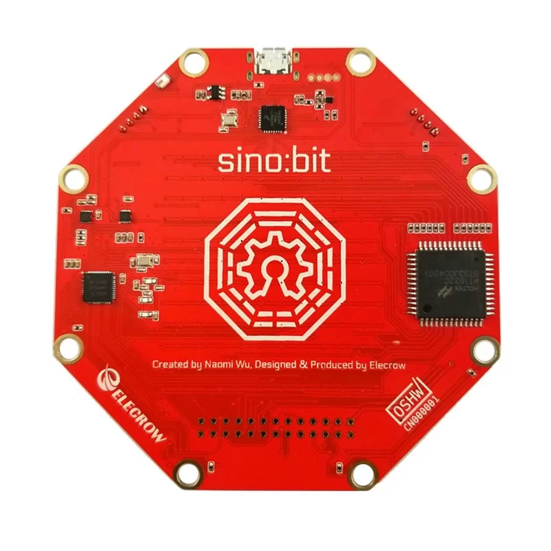
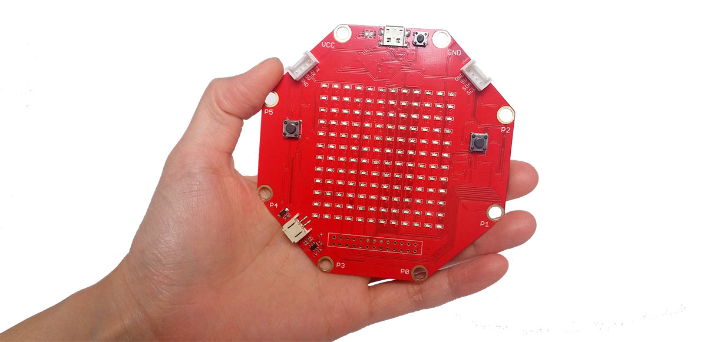

# Sino:bit Board using MicroPython

Code sinppets for Sino:bit Board with MicroPython.

<picture>
  
</picture>

This repository contains the following code examples:

* [Counter](counter.py)
* [Compass](compass.py)
* [Analog Watch](analog_watch.py)
* [Arc Reactor](arc_reactor.py)
* [Conway](conway.py)

To try the code snippets on Sino:bit board, try this [microPython editor for Sino:bit](https://tdicola.github.io/sinobit-micropython/editor/editor.html).

Watch the implementation of this code on our YouTube channel: https://www.youtube.com/@Roboticxps

<picture>
  
</picture>

To get your own Sino:bit Board, visit our online store: https://roboticx.ps/

Follow us on social media:

* Facebook: https://www.facebook.com/Roboticxps
* Instagram: https://www.instagram.com/roboticx.ps/
* YouTube: https://www.youtube.com/@Roboticxps
* LinkedIn: https://www.linkedin.com/company/roboticx/
